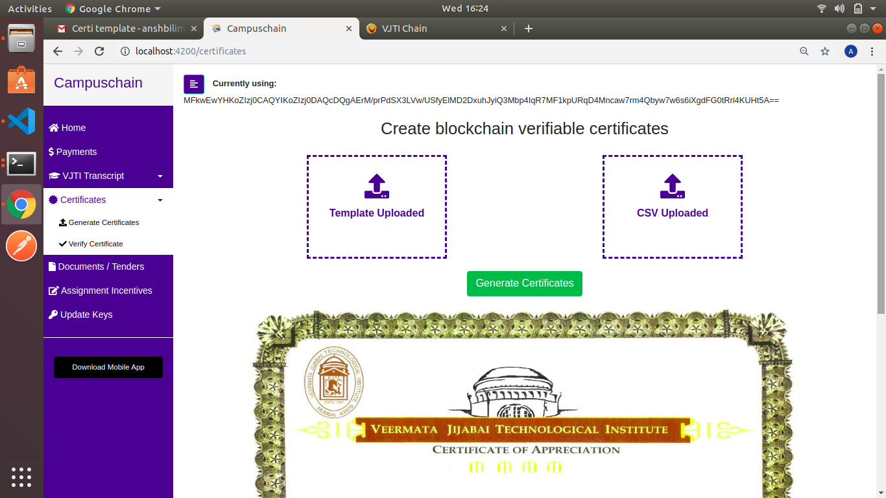
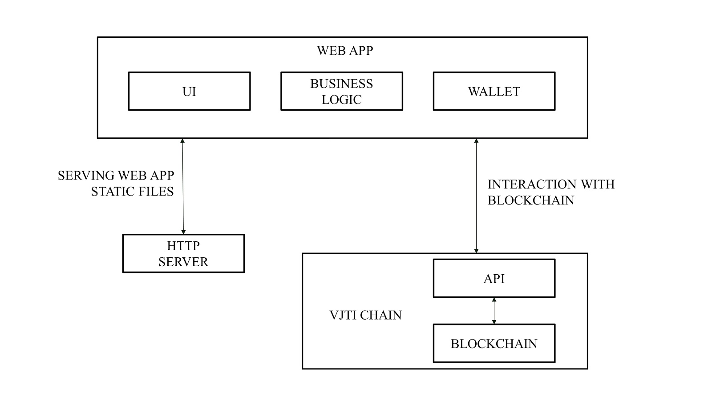

<h1 align="center">Campuschain</h1>
<h3 align="center">Blockchain-based solution to improve Academic Governance</h3>

<h2 align="center">Demo</h2>

Click the image below to view the demo  

## Use Cases Implemented
* Payments
* Transcripts Authentication
* Certificate Generation and Validation
* Document Verification
* Assignment Incentives
* Key Management (Elliptic Curve: p256)

<h2 align="center">Architecture</h2>

The application is fully compatible with the VJTIchain and has been tested locally by creating a testbed with a local instance of the chain

## Deployment
`npm install`  
`npm run build`  

`cd server`  
`npm install`  
`export PORT=YOUR_PORT_NUMBER`  
`node app`  
